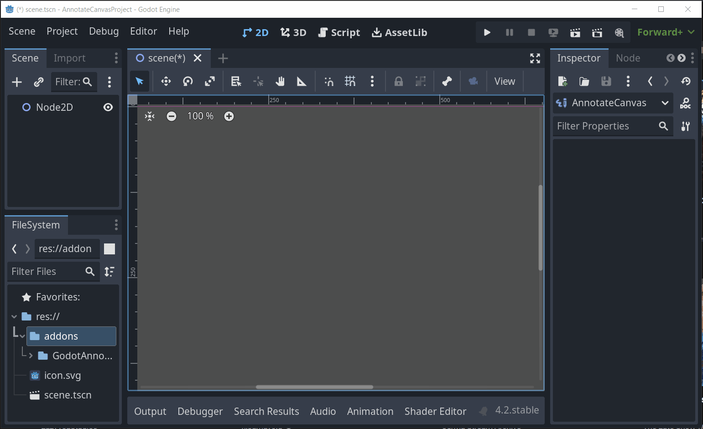
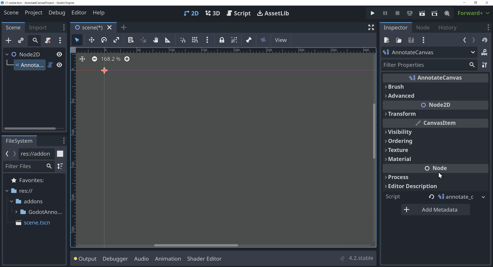
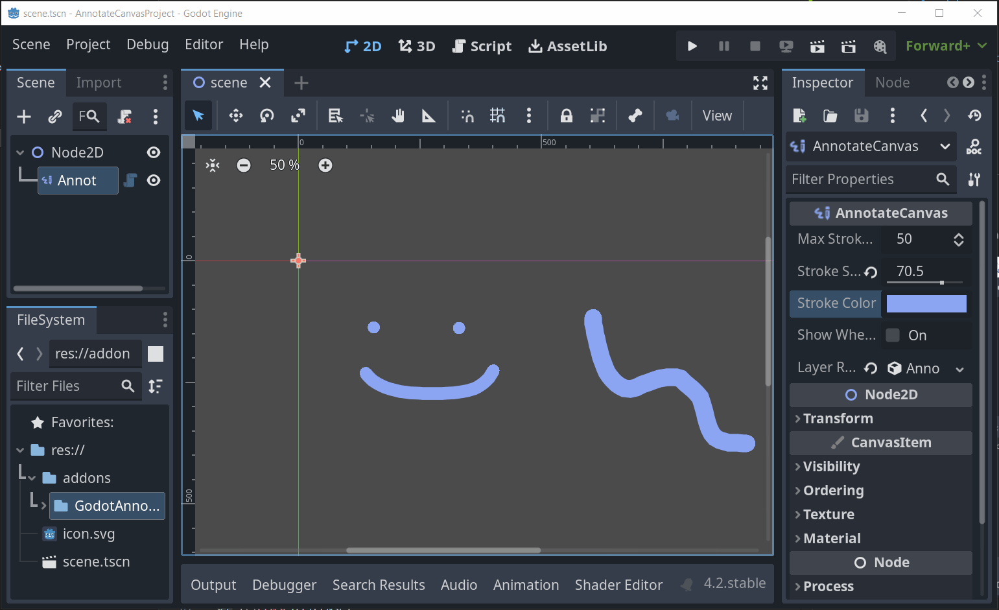
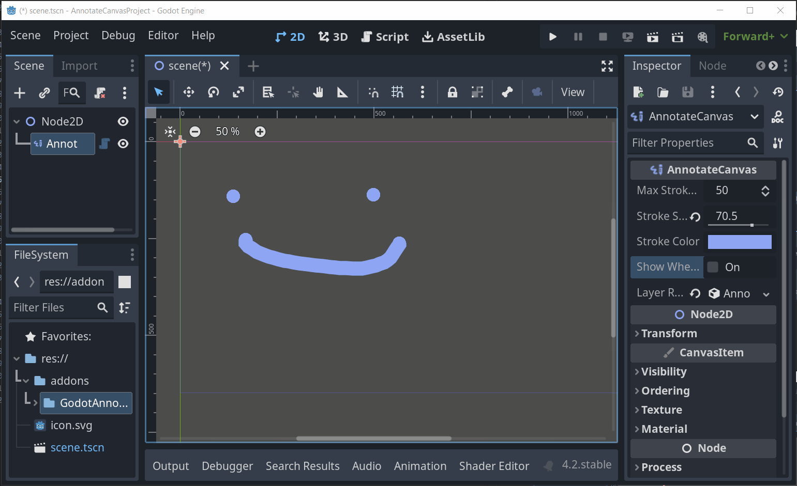

  <h1 align="center">Godot Annotate</h1>
  

This is a [Godot](https://godotengine.org/) plugin which allows one to make planning  annotations and sketches directly in the 2D editor, without affecting runtime visuals, using a custom 'AnnotateCanvas' node.

- [Features](#features)
  - [Annotate](#annotate)
  - [Polygon Mode](#polygon-mode)
  - [Erase](#erase)
  - [Control Annotation Visibility](#control-annotation-visibility)
  - [Save Canvas As Image](#save-canvas-as-image)
- [Usage](#usage)
  - [Controls](#controls)
  - [Locking](#locking)
- [Installing](#installing)
- [Links](#links)
- [License](#license)

## Features

### Annotate

Annotate with variable brush size and color directly in the 2D editor using the 'AnnotateCanvas' node.

### Polygon Mode

Use polygon mode to draw straight lines between clicks.

### Erase

Erase any previously drawn annotate strokes.

### Control Annotation Visibility

Only show annotations in the 2D editor (optionally show in run mode).

### Save Canvas As Image

Save the canvas to disk as an image file.

## Usage

To start annotating, add the 'AnnotateCanvas' node to a godot scene.

### Controls

**Left Mouse Button**
: Annotate on the currenty selected 'AnnotateCanvas' node.

**Alt + Left Mouse Button**
: Annotate on the currently selected 'AnnotateCanvas' node using the polygon mode.

**Right Mouse Button**
: Erase annotate strokes on the currently selected 'AnnotateCanvas' node.

**Shift + Mouse Scroll**
: Change brush size.

**Shift + Alt + S**
: Save the selected 'AnnotateCanvas' to disk as an image.

### Locking

Locking an 'AnnotateCanvas' node does not prevent it from being drawn on, instead toggle the 'Advanced > Lock Canvas' property to prevent this.

## Installing

See [Installing Plugins](https://docs.godotengine.org/en/stable/tutorials/plugins/editor/installing_plugins.html), for how to add this plugin to your Godot project.

## Links

[Godot Assets](https://godotengine.org/asset-library/asset/2432)

## License

See [LICENSE](LICENSE)
