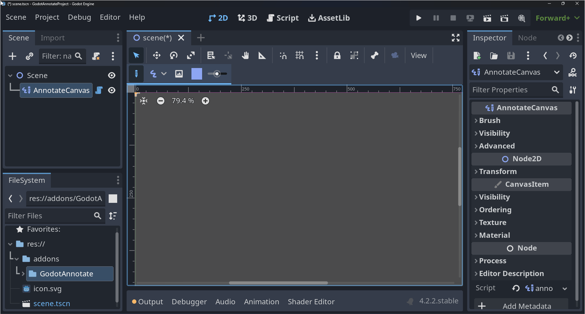
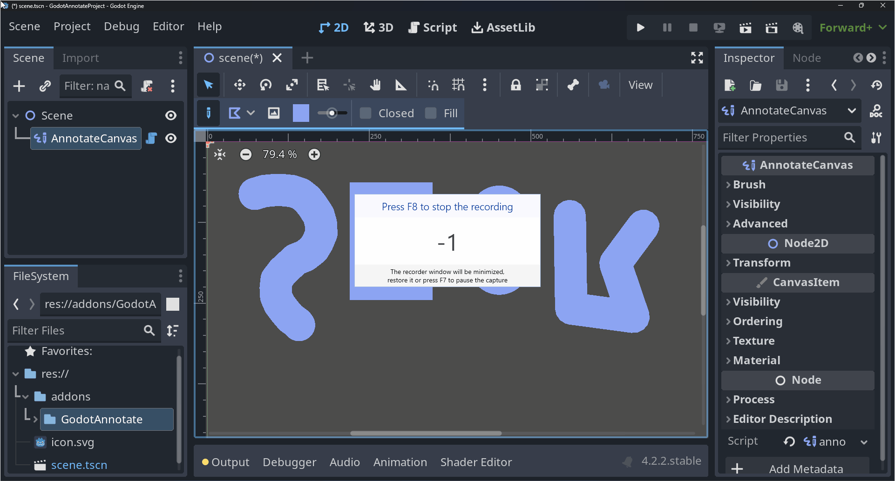
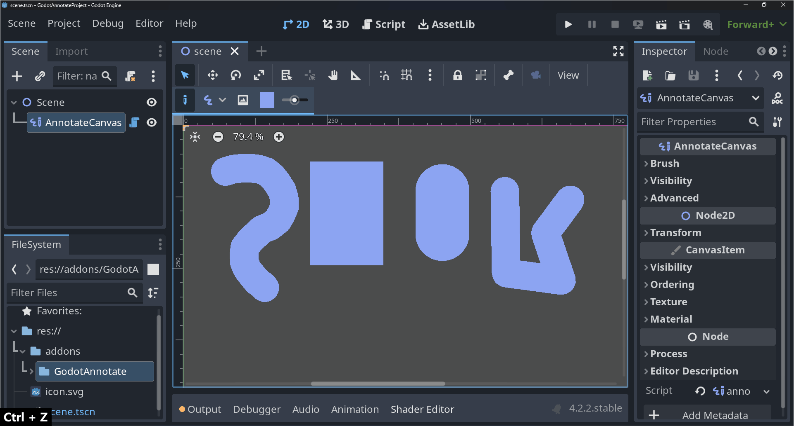
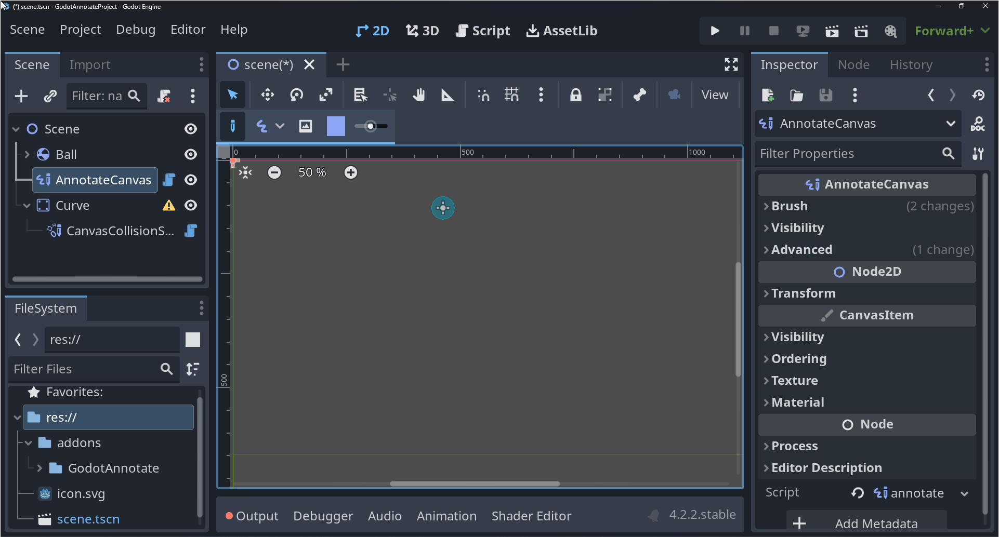
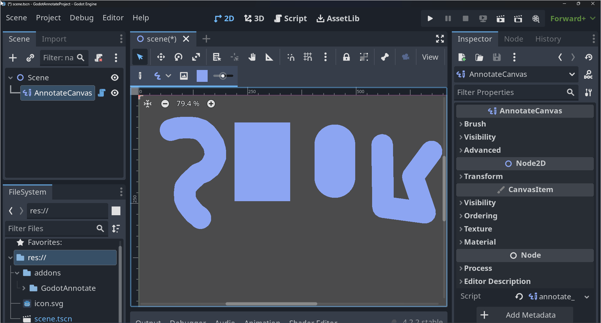
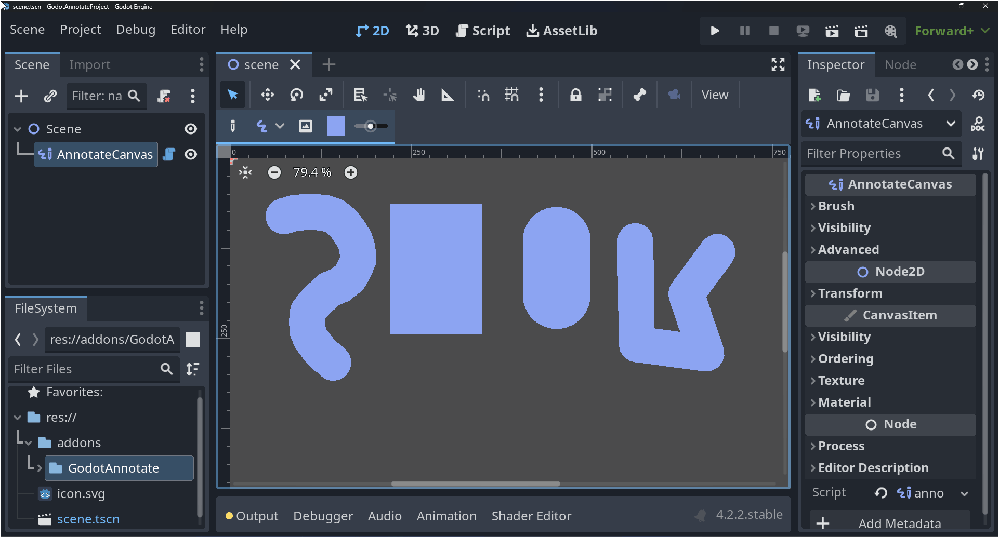
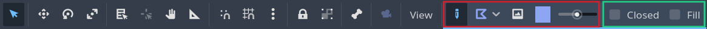
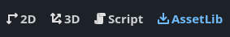

  <h1 align="center">Godot Annotate</h1>
  

**Godot Annotate** is a [Godot](https://godotengine.org/) plugin which allows one to make mockups and sketches directly in the 2D editor using a custom **AnnotateCanvas**![canvas-icon] node.

<!-- omit in toc -->
## Table of Contents
- [Features](#features)
  - [Sketch With Multiple Brushes](#sketch-with-multiple-brushes)
  - [Edit Strokes After Drawing Them](#edit-strokes-after-drawing-them)
  - [Undo / Redo Strokes](#undo--redo-strokes)
  - [Generate Hitboxes from Canvas](#generate-hitboxes-from-canvas)
  - [Control Canvas Visibility](#control-canvas-visibility)
  - [Save Canvas As Image](#save-canvas-as-image)
- [Usage](#usage)
  - [Quick Start](#quick-start)
  - [Annotate and Edit Mode](#annotate-and-edit-mode)
  - [Hitbox Generation](#hitbox-generation)
  - [Save as Image](#save-as-image)
- [Installing](#installing)
  - [Latest Version](#latest-version)
  - [Any Version](#any-version)
- [Links](#links)
- [License](#license)

## Features

### Sketch With Multiple Brushes

Draw sketches or mockups with variable brush size and color directly in the 2D editor using the **AnnotateCanvas**![canvas-icon] node.

The following brushes are avaliable:
- **Freehand**
- **Rectangle**
- **Capsule**
- **Polygon**

### Edit Strokes After Drawing Them

Edit strokes size, colour, bounding rect and custom variables (like fill) after they have been drawn.

### Undo / Redo Strokes

Each action performed in a **AnnotateCanvas**![canvas-icon] is added to the editors undo / redo history, so you dont have to wory about drawing the perfect stroke first try every time.

### Generate Hitboxes from Canvas

Use the **CanvasCollisionShape**![canvas-collision-shape-icon] node to convert all sketches in a **AnnotateCanvas**![canvas-icon] to a series of CollisionShape2D's.

### Control Canvas Visibility

Control whether **AnnotateCanvas**![canvas-icon] should be visible when running or only visible in the editor.

### Save Canvas As Image

Save the **AnnotateCanvas**![canvas-icon] to disk as an image file.

## Usage

### Quick Start

To start annotating, add the **AnnotateCanvas**![canvas-icon] node to a godot scene, then perform one of the following actions.

**Left Mouse Button**
: Draw a stroke on the currenty selected **AnnotateCanvas**![canvas-icon] node.

**Right Mouse Button**
: Erase strokes on the currently selected **AnnotateCanvas**![canvas-icon] node.

You can configure various properties like brush type, stroke size and color via. the toolbar that shows up, when a canvas is selected.

Some brush types also provide configurable variables in the toolbar, when they are selected.

> Red / Left box: General toolbar&emsp;&emsp;&emsp;&emsp;Green / Right box: Brush specific toolbar

### Annotate and Edit Mode

A canvas has to primary modes, the **Annotate Mode** and the **Edit mode**.
You can see and change which mode the selected canvas is currently in via. the **Mode**switch on the toolbar. If it is highlighted it is in **Annotate Mode**, otherwise it is in **Edit Mode**.

**Annotate Mode** is the default mode. When in this mode, you can draw and erase strokes on the canvas.

**Edit Mode** allows one to select strokes on the canvas and perform edits on them, such as resizing them or change various other properties via. the editor's node inspector. 

### Hitbox Generation

Perform the following steps to generate a hitbox from an **AnnotateCanvas**![canvas-icon].

- add a **CanvasCollisionShape**![canvas-collision-shape-icon] node as a child of any [**CollisionObject2D**](https://docs.godotengine.org/en/stable/classes/class_collisionobject2d.html) node.
- Assign the **Canvas** property to the desired **AnnotateCanvas**![canvas-icon] node.

This adds a series of [**CollisionShape2D**](https://docs.godotengine.org/en/stable/classes/class_collisionshape2d.html) nodes to the **CanvasCollisionShape**'s![canvas-collision-shape-icon] parent, which represent the hitbox of all strokes present in the assigned **AnnotateCanvas**![canvas-icon]. 

### Save as Image

- Press the **Capture Canvas**  button.
- Choose the upscale factor in the following popup window[^1].
- Specify the path of the image file, and press **Ok**

## Installing
> [!IMPORTANT]
> Make sure to [**enable the plugin**](https://docs.godotengine.org/en/stable/tutorials/plugins/editor/installing_plugins.html#enabling-a-plugin) after it has been installed, otherwise the AnnotateCanvas node will not show up.

> [!CAUTION]
> **v0.3.x** is not compatible with **v1.x** or later. This means all AnnotateCanvas nodes need to be **DELETED AND REDRAWN** if you want to update this plugin from v0.3.x to a later version. If you want to install a v0.3.x version of this plugin, please refer to the [**Any Version**](#any-version) install section.

### Latest Version
Go to **AssetLib** in the Godot editor, and search for '**Godot Annotate**'.

Click the '**Godot Annotate**' addon and click '**Download**' in the popup window.

When the download has finished, ensure '**Ignore asset root**' is checked and click '**Install**'.

The '**Godot Annotate**' plugin has now been installed! Remember to [**Enable**](https://docs.godotengine.org/en/stable/tutorials/plugins/editor/installing_plugins.html#enabling-a-plugin) it before using it!

### Any Version

Download the required version from the [**Releases**](https://github.com/zarstensen/GodotAnnotate/releases) page.

See [**Installing Plugins from Github**](https://docs.godotengine.org/en/stable/tutorials/plugins/editor/installing_plugins.html#installing-a-plugin), for how to install the downloaded addon in your Godot project.

## Links

[Godot Asset Library](https://godotengine.org/asset-library/asset/2432)

## License

See [LICENSE](LICENSE)

[^1]: The upscale factor is based on the window resolution, so if the canvas takes up a total of 100 x 100 px's worth of window space, an upscale factor of 1 would produce an 100 x 100 px image, whilst an upscale factor of 2 would produce a 200 x 200 px image.

[canvas-icon]: src/canvas/annotate_canvas_icon.svg
[canvas-collision-shape-icon]: src/collision/canvas_collision_shape_icon.svg
